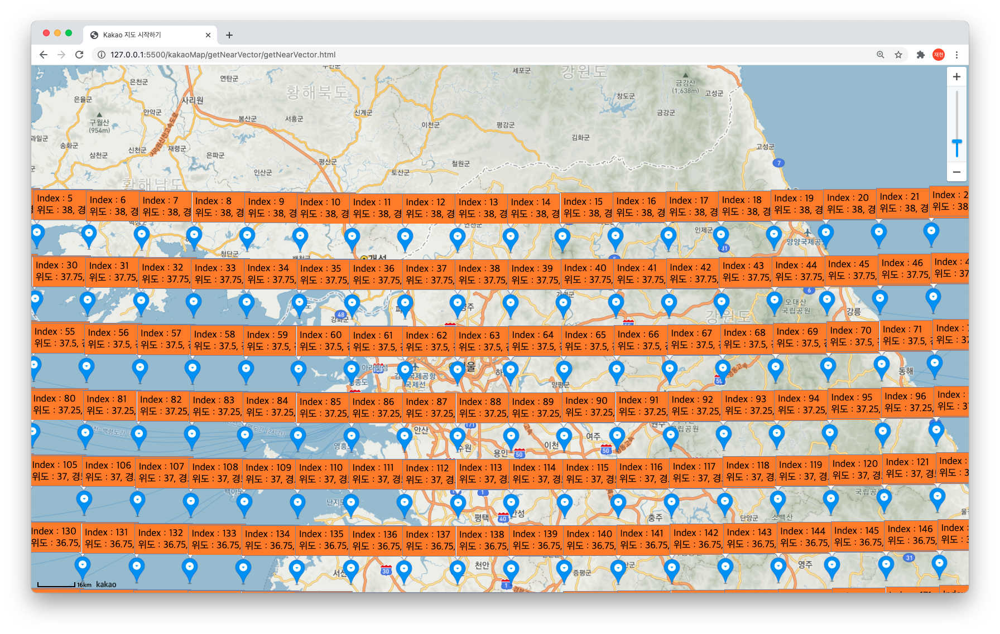

# [windMap] 6. 지도의 위치에 따라 동적으로 바뀌는 WindMap 만들기

Demo: http://211.214.35.45:14000/Chap6

기본 원리는  Chap4에서는 고정된 여러개의 벡터였지만, 여기서는 기준이 되는 벡터들이 변할 수 있다는 점이다.


맵 전체를 덮는 벡터 배열을 저장한다.  
->  
지도상의 위치를 위도, 경도로 변환해한다.  
->  
특정 위도, 경도에서의 영향을 받는 벡터 4개를 계산한다  
->  
벡터를 알아내 애니메이션으로 뿌린다.  


## step1 
### 특정 위도 경도(0.25, 0.5, 1씩)마다 지점의 x,y 벡터를 기록한다. 
(현재는 임의의 값)
1.9,-1.4,1.5,-1.5,1.7,-0.7,0.8,-1.6,1.9,-1.2...
경도 124 ~ 130 도
위도 33 ~ 38도
gridGap = 0.25
위 좌표정도면 우리나라를 다 덮는다.
```javascript
function readGrid() {
    count = 0
    for (i = 0; i < 21; i++) {          //위도
        grid[i] = []
        for(j = 0; j < 25; j++){            //경도
            grid[i][j] = []
            grid[i][j][0] = gridData[count++]
            grid[i][j][1] = gridData[count++]
            grid[i][j][2] = count / 2
        }
        
    }
}
```

위도 : 21개
경도 : 25개의 
격자가 생긴다.  
(해당 이미지는 참고용임)  



## step2 
### 바람 객체를 생성할때, element의 x,y값 뿐만 아니라 지도상에서 위도, 경도도 저장한다.
kakaoMap에는 Element의 x,y 좌표를 latitude, longitude로 바꿔주는 메소드가 존재한다.
이 메소드를 통해,element위의 x,y 좌표로 지도상 같은 지점의 latitude, longitude를 얻을 수 있다.
```javascript
coordinate = map.getProjection()
point = new kakao.maps.Point(x, y)
coordinate.coordsFromContainerPoint(point).La //경도
coordinate.coordsFromContainerPoint(point).Ma //위도
```

## step3
### 위도, 경도로 해당 위.경도의 벡터를 구한다.

1. 해당 위도.경도의 평면(어느 벡터의 영향을 받는지 Chap3 참고)을 구한다.
```javascript
function selectGrid(latitude, longitude) {                                
    gridlng = parseInt((longitude - 124) / 0.25)         //ex) 125.1 -> 4 
    gridlat = parseInt((38 - latitude) / 0.25)           //ex) 37.3 -> 2
    return [gridlat, gridlng]
}
```
해당하는 평면을 좌표 쌍으로 리턴한다.

2. 해당 평면에서의 벡터를 bilinear interpolation 으로 보간값을 구한다.
```javascript
var interpolate = function (latitude, longitude, g00, g10, g01, g11, gridn) {
    x = (longitude % 0.25) * 4
			//해당 평면에서의 비율을 측정함.	기존의 방법이랑 동일.

    d1 = x
    d2 = 1 - x

    let x1_vector_x = d1 * g10[0] + d2 * g00[0]
    let x1_vector_y = d1 * g10[1] + d2 * g00[1]
    let x2_vector_x
    let x2_vector_y
    try {
        x2_vector_x = d1 * g11[0] + d2 * g01[0]
        x2_vector_y = d1 * g11[1] + d2 * g01[1]
    } catch (error) {
        debugger;
    }


    y = (latitude % 0.25) * 4
    d4 = y
    d3 = 1 - y

    result_vector_x = d3 * x2_vector_x + d4 * x1_vector_x
    result_vector_y = d3 * x2_vector_y + d4 * x1_vector_y
    result_vector_scale = Math.sqrt(result_vector_x * result_vector_x + result_vector_y * result_vector_y)

    result_vector = [result_vector_x, result_vector_y, result_vector_scale]
    return result_vector                //보간값 리턴
}

function getVector(latitude, longitude) {                       
    if (latitude <= 33 || latitude >= 38) return [1, -1, 1.4]             
// 만약 위도 33 이하, 38 이상이면 1, -1 벡터 리턴, 캔버스 내부에 있지만 해당 좌표를 가질 수 있다.
    if (longitude <= 124 || longitude >= 130) return [1, -1, 1.4]         
// 만약 경도 124 이하, 130 이상이면 1, -1 벡터 리턴,캔버스 내부에 있지만 해당 좌표를 가질 수 있다.

    gridn = selectGrid(latitude, longitude);                            
// 현재 벡터에서 그리드 계산
    g00 = grid[gridn[0]][gridn[1]]                                      
    g10 = grid[gridn[0]][gridn[1] + 1]
    g01 = grid[gridn[0] + 1][gridn[1]]
    g11 = grid[gridn[0] + 1][gridn[1] + 1]                              
    // 현재 좌표를 감싸는 네(4) 그리드 계산

    return interpolate(latitude, longitude, g00, g10, g01, g11, gridn)      
// 4 그리드로 보간값 구해서 리턴
}
```

## step4
### 해당 위도, 경도에서 구한 벡터값으로, canvas에 애니메이션을 표시한다.

#### line의 이동을 위한 메소드
```javascript
    this.dr = function () {
        if (this.x > cnx || this.y > cny || this.x < 0 || this.y < 0) {                
//만약 캔버스 범위를 벗어나면 삭제
            return removeObj(this.index)
        } else {
            if (currentFrame - this.frame > getRandomArbitrary(100, 250)) {             
// 100프레임 (1 ~ 2초) 에서 250프레임 (4초정도) 지나면 삭제
                removeObj(this.index)
            }
            const ls = {                                                               
 // 이동을 위한 현재 위치 기록
                x: this.x,
                y: this.y
            };

            nextVec = getVector(this.latitude, this.longitude)                          
// 현재 좌표에서 벡터 계산
            this.x = ls.x + nextVec[0]                                                  
// 현재 좌표에서 벡터만큼 이동                                                                                                      
            this.y = ls.y + nextVec[1]                                                  
// 현재 좌표에서 벡터만큼 이동                                                                                                      

            point = new kakao.maps.Point(this.x, this.y)
            this.latitude = coordinate.coordsFromContainerPoint(point).Ma              
// 이동한 만큼 다시 현재 위치 계산
            this.longitude = coordinate.coordsFromContainerPoint(point).La              
// 이동한 만큼 다시 현재 위치 계산

            c.beginPath();
            c.lineWidth = 2;
            if (nextVec[2] > 1.5) {
                c.strokeStyle = "rgb(255,30,0)";
            } else if (nextVec[2] > 1.3) {
                c.strokeStyle = "rgb(255, 50, 0)";
            } else {
                c.strokeStyle = "rgb(255, 100, 0)";
            }
            // c.strokeStyle = "rgb(255,0,0)";
            c.moveTo(ls.x, ls.y);
            c.lineTo(this.x, this.y);
            c.stroke();
            c.closePath();

            //기록한 현재 위치와 바뀐 위치까지 그림.
        }
    }
```
보면 계산은 위도, 경도로 하게되고
Canvas에 그림은 element의 x,y 값으로 하게 되는걸 알 수 있다.

알고리즘 적인 부분만 기술하였으며 자세한 내용은 코드를 참고할것.

